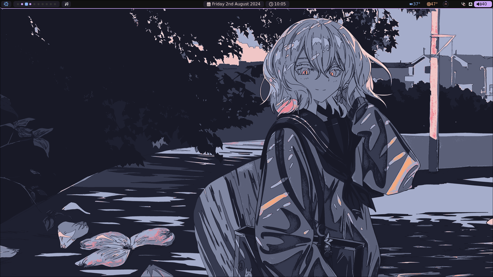
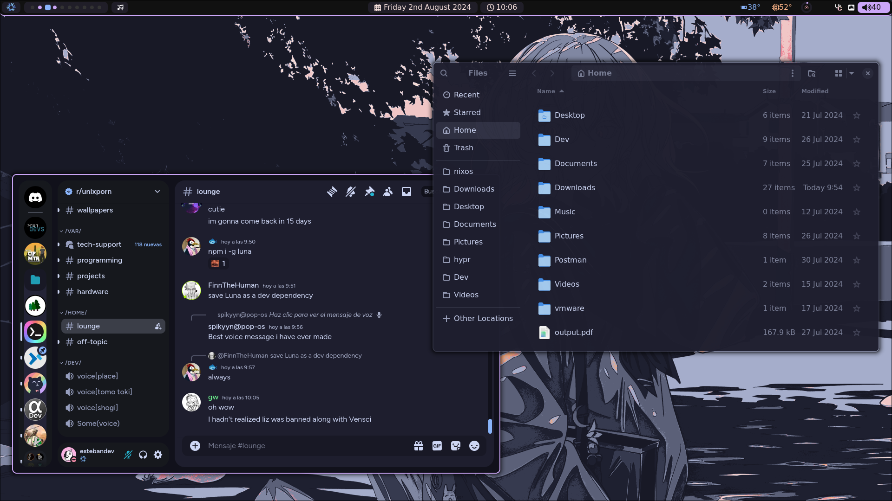
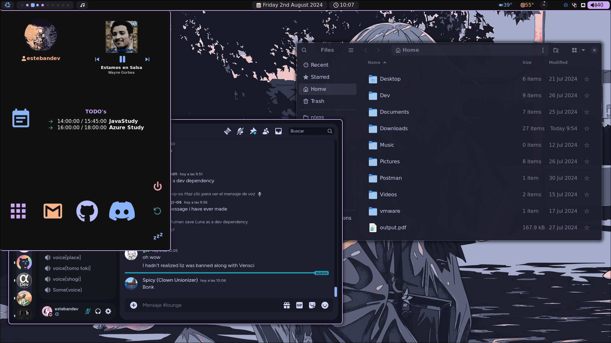

# CatppuccinDotFiles

# Hyprland GruvBox

- Term `kitty`
- WM `Hyprland`
- Browser `Brave`
- StatusBar `eww`
- Distro `NixOS`
- Notifications `dunst`
- AppManager `wofi`
- File Manager `nautilus`

I use Nixos recently, my dotfiles even They are still somewhat manual although most things work automatically with Stylix 
